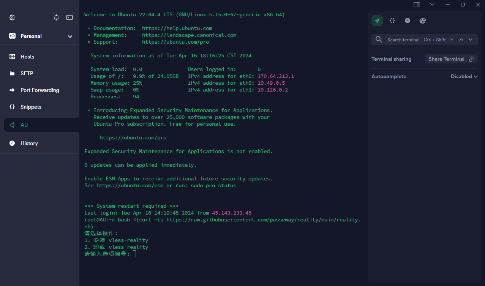

## 预览



# Xray Reality 自动化安装脚本
该脚本自动安装并配置了 Xray，并使用了 Reality 传输协议。Xray 是一个功能强大的代理平台，支持多种传输协议，包括 Reality，它提供了更高级的安全性和混淆功能。

## 一键脚本
```bash
bash <(curl -Ls https://raw.githubusercontent.com/passeway/reality/main/reality.sh)
```
## 详细说明

- 安装 Xray 并配置 Reality 传输协议。
- 输出客户端配置 URL，方便快速设置。


